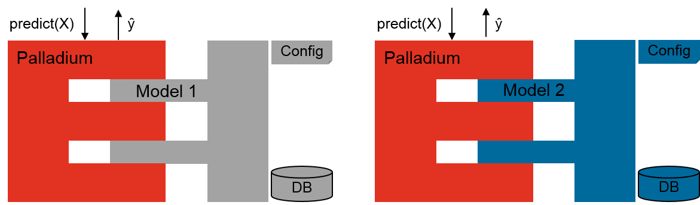

Palladium
=========

Palladium provides means to easily set up predictive
analytics services as web services.  It is a **pluggable framework**
for developing real-world **machine learning solutions**.  It provides
generic implementations for things commonly needed in machine
learning, such as dataset loading, model training with parameter
search, a web service, and persistence capabilities, allowing you to
concentrate on the core task of developing an accurate machine
learning model.  Having a well-tested core framework that is used for
a number of different services can lead to a reduction of costs during
development and maintenance due to harmonization of different services
being based on the same code base and identical processes. Palladium
has a web service overhead of a few milliseconds only, making it
possible to **set up services with low response times**.

A **configuration file** lets you conveniently tie together existing
components with components that you developed.  As an example, if what
you want to do is to develop a model where you load a dataset from a
CSV file or an SQL database, and train an SVM classifier to predict
one of the rows in the data given the others, and then find out about
your model's accuracy, then that's what Palladium allows you to do
**without writing a single line of code**. However, it is also
possible to independently integrate own solutions.

|

Much of Palladium's functionality is based on the **scikit-learn** library.
Thus, a lot of times you will find yourself looking at the
`documentation for scikit-learn <http://scikit-learn.org/>`_ when
developing with Palladium.  Although being implemented in Python, Model
Stack provides support for other languages and is shipped with
examples how to **integrate and expose R and Julia models**.

For an efficient deployment of services based on Palladium, a script to
**create Docker images automatically** is provided. In order to manage
and monitor a number of Palladium service instances in a cluster,
**Mesosphere’s Mesos framework Marathon can be used for deployment**,
also enabling **scalability by having a variable number of service
nodes behind a load balancer**.  Examples how to create Palladium
Docker images and how to use them with Mesos / Marathon are part of
the documentation. Other important aspects – especially relevant in
enterprise contexts for setting up productive services – like
**authentication, logging, or monitoring, can be easily integrated via
pluggable decorator lists** in the configuration file of a service,
keeping track of service calls and corresponding permissions.

Links
-----

- Source code repository at GitHub: https://github.com/ottogroup/palladium
- Documentation including installation instructions and tutorial: http://palladium.readthedocs.org
- Maintainer: `Andreas Lattner <https://github.com/alattner>`_

Related Projects
----------------

There are a number of other interesting projects out there which have
some features in common with Palladium. In the following, we will mention a
selection.

- `DOMINO <http://www.dominodatalab.com>`_

  Infrastructure for data analysis (PaaS). A UI for running and
  examining experiments is provided. Experiments can be run in
  parallel and notification mechanisms can be set up. Models can be
  deployed as web services (referring to DOMINO's documentation, the
  overhead for the HTTP server is about 150ms) and model updates can
  be scheduled. Supports Python, R, Julia, Octave, and SAS
  models. Commercial.

- `PredictionIO <http://prediction.io>`_

  ML server based on Hadoop / Spark. Two engine templates for Apache
  Spark MLlib are provided for setting up a recommendation engine or a
  classification engine. It also allows for gathering new
  events. Supports Spark MLlib and Scala models (no support for
  Python, R, Julia). Open source.

- `Scikit-Learn Laboratory
  <http://https://github.com/EducationalTestingService/skll>`_

  Tool to support experiments performed with scikit-learn. It allows
  to run various settings on different test sets and to get a summary
  of the test's results. It does not aim at exposing models as web
  services. Supports Python models (no support for R or Julia). Open
  source.

- `yhat ScienceOps <http://yhathq.com>`_

  Platform for managing predictive models in production environments
  (PaaS). A command line tool and GUI are available for model
  management. It also provides a Load Balancer and can automatically
  scale the servers as needed. Supports Python and R
  models. Commercial.
